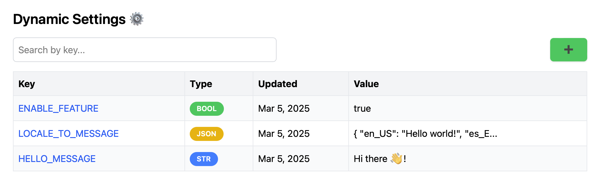

# ⚙️️ Dynamic Settings

**Dynamic Settings** is a lightweight, real-time configuration management service
that allows you to store and update settings dynamically without redeploying your application.
It provides a web-based UI and an API to manage key-value pairs efficiently.


---

## 🚀 Quick setup
```
docker pull markantipin12/dynamic-settings

docker run -d -p 18100:18100 markantipin12/dynamic-settings

open http://localhost:18100
```

### Environment Variables
```
APPLICATION_PORT=18100	# The port on which the application will run
API_KEY=api-key # The API key to access the API
```


## ✨ Why Dynamic Settings?

- 🦀 **Built with Rust** – Designed for speed, safety, and low resource consumption.
- 🔧 **Live Configuration Updates** – Modify settings in real-time without restarting your application.
- 🏗️ **API-Driven** – A RESTful API for programmatic access to settings.
- 🖥️ **User-Friendly UI** – Manage settings through an intuitive web interface.

---


## 🛠 Development
### With docker
```
docker build -t dynamic-settings .

docker run -d -p 18100:18100 dynamic-settings
```

### Without docker
#### Backend
**Run**
```
cargo run
```
**Test**
```
cargo test
```
**Linter**
```
cargo clippy --all-targets --all-features
```

#### Frontend (ui folder)
**Install dependencies**
```
npm install
```
**Run**
```
npm start
```
**Build**
```
npm run build
```
**Linter**
```
npm run lint
```
