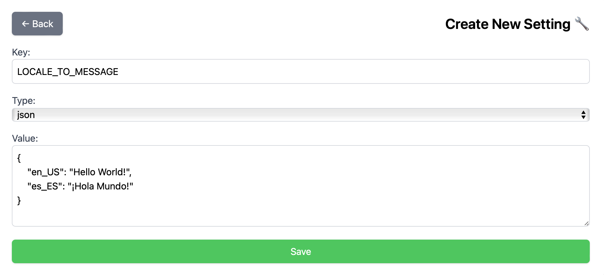
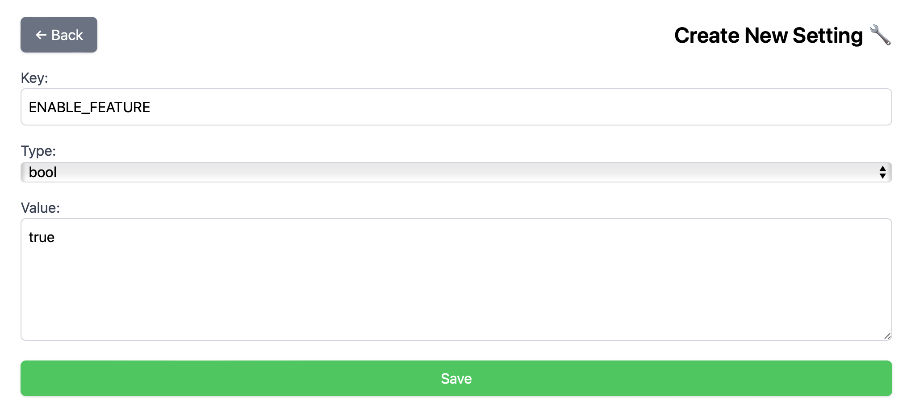
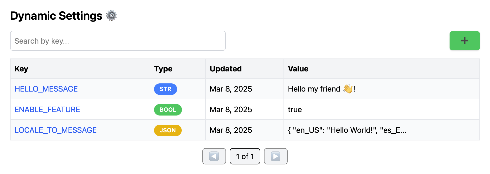

# How to use

**Dynamic Settings** provides two core functionalities:

- **Dynamic Configuration**
- **Feature Flags**

## ⚙️ Dynamic Configuration

Store any type of settings and manage them in real-time without restarting your application.
Supported types:

- **String**
- **Integer**
- **Float**
- **Boolean**
- **JSON (Array can be stored as well)**

## 🚩️ Feature Flags

Enable or disable features in your application without redeploying it.

## 🔧 Manage Your Settings

Monitor and update your settings seamlessly via the management interface.
